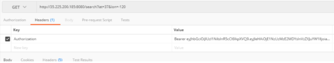

# Around-Backend
This project is the back-end service of [AroundWeb](https://github.com/GGtray/Around-Web), 
providing ElasticSearch indexing and storage service for front end web application. 
Use GKE for better scaling.
##  Architecture

## Core Features
### Geo-Index
Geo-Indexing is implemented by using google Elastic Search:


The items are indexed by Geo-location: Longitude and latitude.
### Storage using GCS
The large binary files uploaded by user are stored in GCS, providing a URL link in Elastic Search 
database to link them together.


### Detecting face in files using Vision API

### Authentication


Use JWT for authentication



signup then we will receive token


only able to search if we provide correct token

## Deployment
write Dockerfile, build docker image and push it to dockerhub. <br/>
can access via
```
docker pull zhanglizi/around
```
